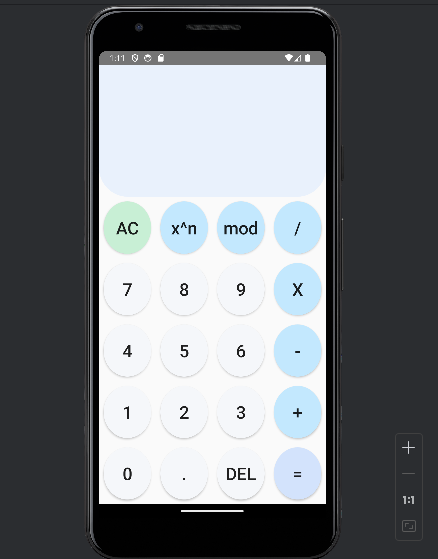

# Calculator Android App

This Android app is a calculator app developed using Java and the Android Studio IDE. It provides basic arithmetic operations, including addition, subtraction, multiplication, division, modulus, and square root.

## Screenshots


## Features
- Basic arithmetic operations: Addition, Subtraction, Multiplication, and Division.
- Additional operations: Modulus, Square Root.
- Delete button to remove the last entered digit.
- Clear button to reset the calculator.
- Decimal point functionality for floating-point numbers.

## Usage
1. Clone the repository:
   ```bash
   git clone https://github.com/omertzroya/Calculator-Android-Project.git
   ```

2. Open the project in Android Studio.

3. Build and run the app on an Android emulator or a physical device.

## Contributing
Feel free to contribute to the project by opening issues or creating pull requests.

## License
This project is licensed under the [MIT License](LICENSE).


